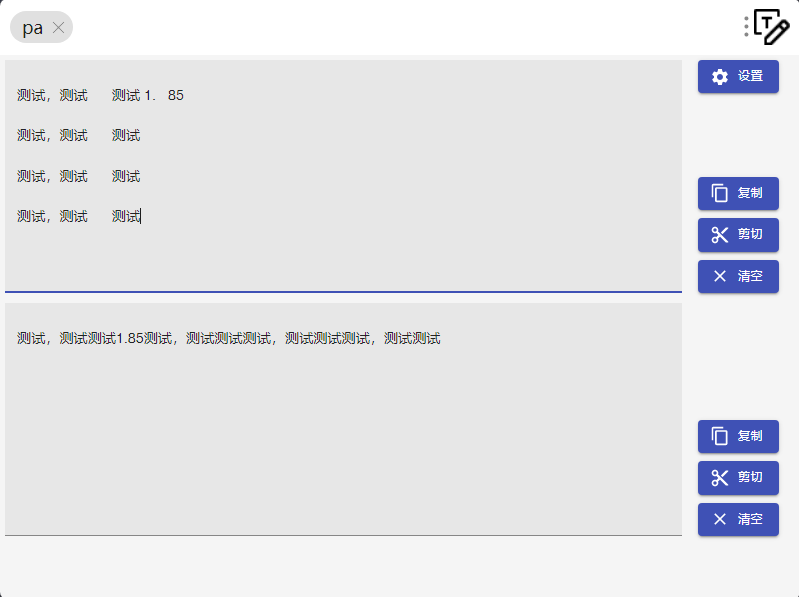
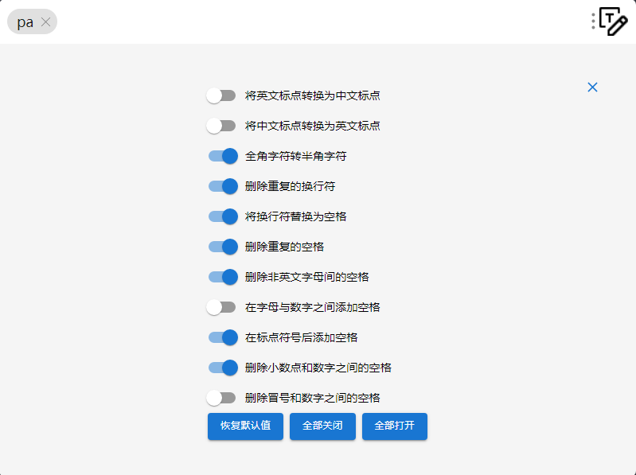
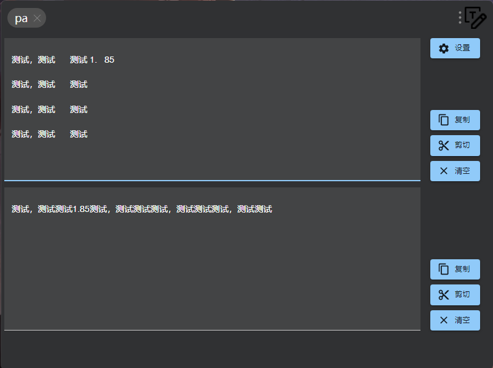
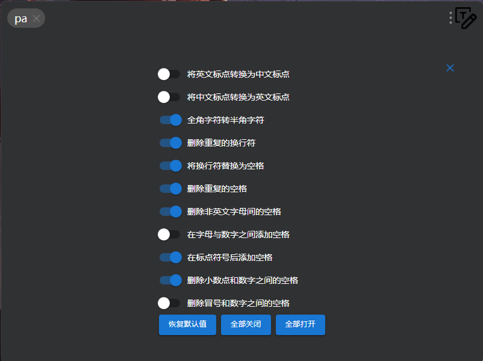
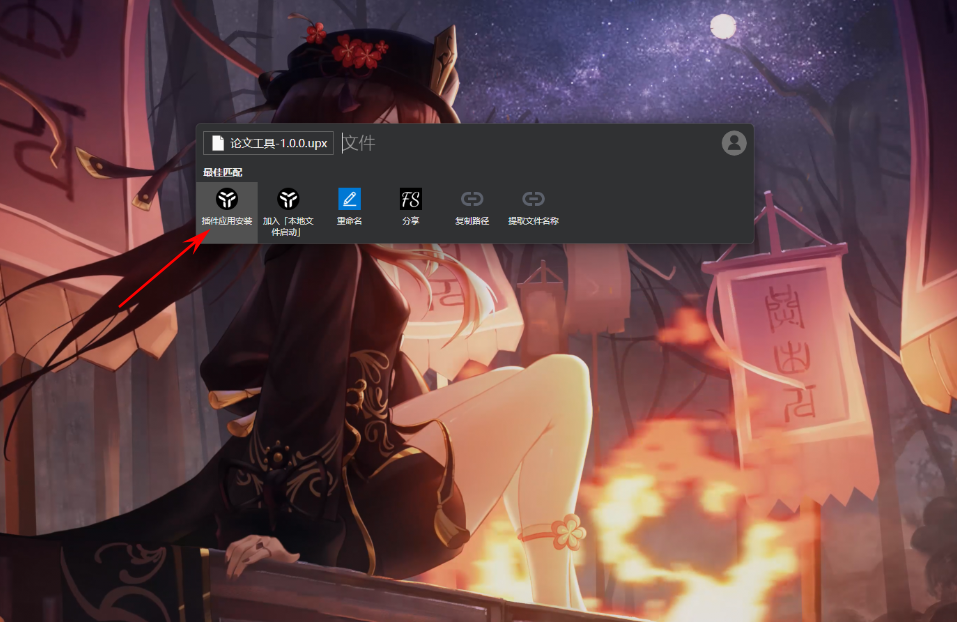

# uTools 插件 - 论文工具

一款 uTools 插件，用于去除复制PDF中的文字时出现的空格、换行、全角字符或乱码。

## 说明
* 本项目是开源项目 **[paper-assistant](https://github.com/laorange/paper-assistant)** 核心功能的 uTools 插件实现

* **文本复制工具** 的核心代码移植自 **[paper-assistant](https://github.com/laorange/paper-assistant)** 的 **[handlers.ts](https://github.com/laorange/paper-assistant/blob/master/src/assets/ts/article-copy-tool/handlers.ts)** 文件

* 本项目基于 uTools 官方开源插件 **[utools-qrcode](https://github.com/uTools-Labs/utools-qrcode)** 修改而来

* 设置数据的保存参考 uTools 官方开源插件 **[utools-code-helper](https://github.com/uTools-Labs/utools-code-helper)** 的 **[Timestamp.js](https://github.com/uTools-Labs/utools-code-helper/blob/main/src/Timestamp.js)** 文件

## 截图
### 明亮模式





### 暗黑模式





## 运行本项目
1. 安装 **[Note.js](https://nodejs.org/en)**
2. 克隆本项目
    ```
    git clone https://github.com/swjqq/utools-paper-assistant.git
    ```
3. 构建运行
    ```
    cd utools-paper-assistant
    npm install
    npm run build
    ```
4. **uTools 开发者工具** 中将 `dist/plugin.json` 加入到本地开发

## 安装插件
1. 在 **[release](https://github.com/swjqq/utools-paper-assistant/releases)** 页面下载 **upx** 离线安装文件到您的电脑
2. **Ctrl+C** 复制下载的文件，然后 **Alt+空格** 唤出 **utools**，选 **插件应用安装** 即可

    